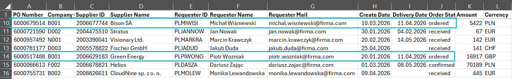
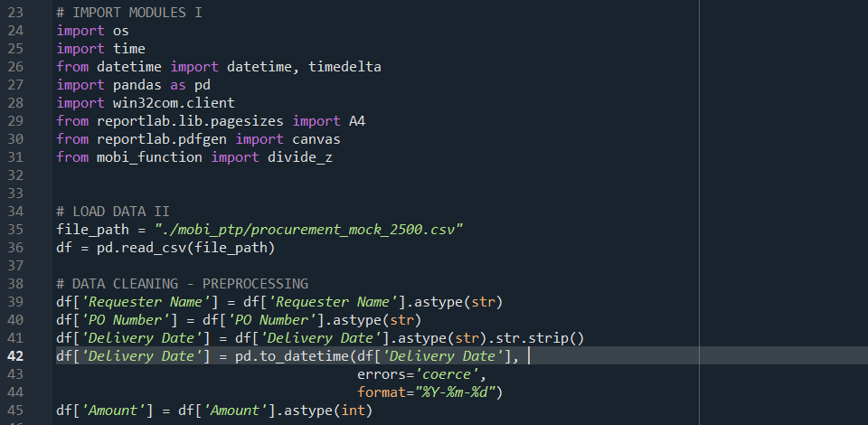
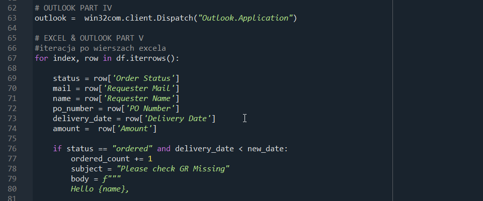
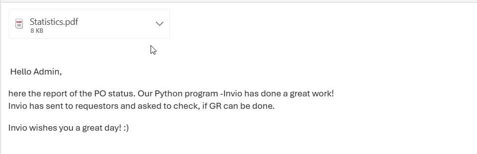

<div style="max-width: 760px;">

# 🪄 Mobi – automation of the “GR missing” process in the PTP/AP area
<hr style="border:1px solid #BFEFFF;">

### Author: Kamila Dudzińska
📊 Project: Mobi – automated email workflow
Mobi is dedicated to operational processes within the Indirect Procurement department.

### 📂 Source: Procurement_mock_dataset1
A mock dataset reflecting the exact technical architecture, data engineering, and business logic of the SAP Ariba system.
The dataset was generated using a Python script I authored — available on my GitHub under the name SAP-Ariba-Mock-Data-Generator-for-Procurement-Analytics. It contains 2500 records.
→ SAP-Ariba-Mock-Data-Generator-for-Procurement-Analytics

SAP-Ariba-Mock-Data-Generator-for-Procurement-Analytics — a synthetic SAP Ariba dataset generator for procurement analytics 📊🧪.
A Python tool designed to generate production‑quality synthetic Purchase Order datasets. It mirrors the technical architecture, data engineering, and business logic of SAP Ariba.
This project solves a key problem for procurement experts transitioning into data analytics: the inability to work with real corporate data due to strict compliance rules, NDAs, and GDPR regulations.

### 🎯 Goal
To create a program that analyzes an Excel table with SAP Ariba purchase order data and automatically sends reminder emails to buyers about the need to post a Goods Receipt (GR).
The program also generates an admin report summarizing who received emails and providing PO statistics.
With one click, it saves significant FTE effort and gives administrators a real-time overview of the process.

### ⚙️ Technologies
- Python 🐍  
- pandas, reportlab, win32com  
- Excel, Outlook


### 🧩 How the program works
1. The program iterates through each row in the purchase order table.

2. If it finds a PO with the status “ordered”, it additionally checks the forecasted delivery date.

3. If the delivery date is in the past (today minus 3 days*), it treats this as a task trigger → sends a reminder email to the buyer to perform the GR.

4. The program reads data from Excel; if a buyer has multiple POs, they receive one email containing details of all relevant orders.

5. After completing the task, the program informs the administrator (via IDE console) and sends a PDF report with statistics to the admin’s email.


### 🖥️ Project advantages
* Addresses a real operational problem requiring repetitive checking and sending reminders/follow-ups.

* Reduces issues with GR posting among non-technical buyers who often claim: “Guided Buying in Ariba doesn’t allow filtering by status.”

* By monitoring PO and GR status, it helps reduce invoice overdue, minimizing supplier risks and reputation issues.

* Provides administrators with statistics, improving GR process control.

* Automates work within the procurement department.

* Designed for typical corporate environments with logged-in Outlook.

* Dedicated to SAP Ariba, but easily adaptable to other systems — simply analyze reports generated by SAP MM or any other procurement platform.

* Code available in the file mobi.py.

<hr style="border:1px solid #BFEFFF;">

### ⚙️ Installation & Launch
🔧 Requirements
Python 3.10+

Installed Outlook (for email sending) and optionally Excel for CSV reading

Libraries: pandas, reportlab, win32com, os, datetime

### 📦 Installation
In the project directory run:

bash
pip install pandas reportlab pywin32
Purchase order table (highlighted in blue: orders where Mobi should send a reminder):
[Wygląda na to, że wynik nie był bezpieczny do pokazania. Zmieńmy coś i spróbujmy czegoś innego!]

Code snippet: Data cleaning
[Wygląda na to, że wynik nie był bezpieczny do pokazania. Zmieńmy coś i spróbujmy czegoś innego!]

Code snippet: Main
[Wygląda na to, że wynik nie był bezpieczny do pokazania. Zmieńmy coś i spróbujmy czegoś innego!]

Email to administrator:
[Wygląda na to, że wynik nie był bezpieczny do pokazania. Zmieńmy coś i spróbujmy czegoś innego!]

<hr style="border:3px solid #AEC6CF;">

### Contact:
[](mailto:kamila.dudzinska@onet.pl)
[](mailto:kamila.dudzinska@onet.pl)
[](https://www.linkedin.com/flagship-web/in/kamila-dudzi%C5%84ska-856bb31b8/)


<hr style="border:1px solid #BFEFFF;">

------------------------------------------- POLISH VERSION --------------------------------------------------

# 🪄 Mobi - autumatyzacja procesu 'GR missing' w obszarze PTP/AP

<hr style="border:1px solid #BFEFFF;">

### Autor: Kamila Dudzińska

### 📊 Projekt: Program 'Mobi' do automatyzacji maili 
Mobi jest dedykowany dla procesów operacyjnych dla działu zakupów (Indirect Procurement).

### 📂 Źródło: Procurement_mock_dataset1 
Mockowy zestaw danych, który odzwierciedla dokładną architekturę techniczną, inżynierię danych oraz logikę biznesową systemu SAP Ariba. Zestaw danych został wygenerowany przez skrypt mojego autorastwa - dostępny na moim Githubie pod nazwą " SAP-Ariba-Mock-Data-Generator-for-Procurement-Analytics". Zawiera 2500 rekordów. --> [SAP-Ariba-Mock-Data-Generator-for-Procurement-Analytics](https://github.com/kamila-dudzinska/SAP-Ariba-Mock-Data-Generator-for-Procurement-Analytics)

" SAP-Ariba-Mock-Data-Generator-for-Procurement-Analytics" - Generator Danych Mockowych SAP Ariba dla Analityki Zakupowej (Procurement) 📊🧪 --> Narzędzie w Pythonie zaprojektowane do generowania syntetycznych, produkcyjnej jakości zestawów danych zamówień zakupu (Purchase Orders). Odzwierciedla ono dokładną architekturę techniczną, inżynierię danych oraz logikę biznesową systemu SAP Ariba. Ten projekt rozwiązuje kluczowy problem ekspertów ds. zakupów (Procurement), którzy chcą przejść do obszaru analizy danych: brak możliwości pracy na realnych danych korporacyjnych ze względu na surowe zasady compliance, umowy NDA oraz regulacje RODO.


### 🎯Cel: 
Stworzenie programu do analizy tabeli excel z danymi o zamówieniach w systemie SAP ARIBA oraz automatycznego wysyłania maili do kupców z przypomnieniem o konieczności zaksięgowania przyjęcia (GR). Program generuje też raport dla administratora, do kogo maile zostały wysłane i jakie są statystyki zamówień. Dzięki temu można jednym kliknięciem zaoszczędzić sporo FTE, a administrator może szybko uzyskać realny "stan rzeczy".


### ⚙️ Technologie:
- Python 🐍  
- pandas, reportlab, win32com  
- Excel, Outlook


### 🧩 Jak działa program
1. Program iteruje wiersz po wierszu w tabeli za zamówieniami. 
2. Jeśli znajdzie zamówienie (PO) ze statusem "ordered" ("zamówione") to sprawdzi dodatkowo prognozowaną datę dostawy (delivery date).
3. Jeżeli data dostawy jest w przeszłości (dzisiaj odjąć 3 dni*) to potraktuje to jako informację do wykonania zadania --> wyśle maila z przypomnieniem o zrobieniu GR do kupca.
5. Program czyta dane z tabeli excel, jeżeli jeden kupiec będzie miał kilka różnych zamówień, to zostaną wysłane do niego szczegóły o wszystkich zamówieniach.
7. Po wykonaniu zadania program poinformuje administratora, gdzie udało mu się wysłać maila - w przypadku aktywnej konsoli IDE oraz dodatkowo wyśle raport ze statystykami w formacie pdf na maila administratora.


### 🖥️ Zalety projektu:
* odpowiada na realny problem w wielu procesach operacyjnych, gdzie wymagane jest sprawdzanie i repetetywne wysyłanie przypominajek/follow-upów
* zmniejsza problem z tworzeniem przyjęcia GR przez nietechnicznych kupców, którzy często nie pilnują swoich zamówień tłumacząc to jako - "W Aribie Guided Buing nie da się filtrować po statusach". 
* dzięki monitorowaniu stanu zamówień (PO) i przyjęć (GR) można zmniejszyć "invoice overdue" (niepłacenie faktur na czas) a co za tym idzie - zminimalizować ryzyko kłopotów z dostawcami, czy utraty wizerunku
* administrator programu otrzymuje statystyki, dzięki czemu łatwiej kontrolować proces GR
* program automatyzuje pracę w obrębie działu zakupów
* program napisany pod typowe środowisko korporacyjne z zalogowanym "Outlookiem"
* program dedykowany SAP ARIBA (z racji, że pracuję na tym programie jako key user) ale można go szybko dopasować do innych systemów - wystarczy przeanalizować raporty generowane np. przez SAP MM, czy inny dowolny program

Kod dostępny w pliky mobi,py

<hr style="border:1px solid #BFEFFF;">


### ⚙️ Instalacja i uruchomienie
#### 🔧 Wymagania
- Python 3.10+  
- Zainstalowany Outlook (dla wysyłki maili) oraz opcjonalnie Excel do odczytu csv
- Biblioteki: `pandas`, `reportlab`, `win32com`, `os`, `datetime`


#### 📦 Instalacja
W katalogu projektu uruchom:
```bash
pip install pandas reportlab pywin32
```

#### Tabela z zamówieniami (na niebiesko te zamówienia, gdzie Mobi powienien wysłać przypominajkę):



#### Fragment kodu: Czyszczenie danych



#### Fragment kodu: Main 



#### Email do administratora:


<hr style="border:3px solid #AEC6CF;">


### Kontakt:  

[](mailto:kamila.dudzinska@onet.pl)
[](mailto:kamila.dudzinska@onet.pl)
[](https://www.linkedin.com/flagship-web/in/kamila-dudzi%C5%84ska-856bb31b8/)


