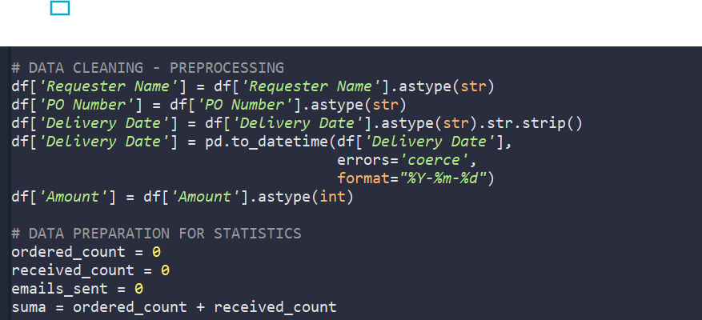
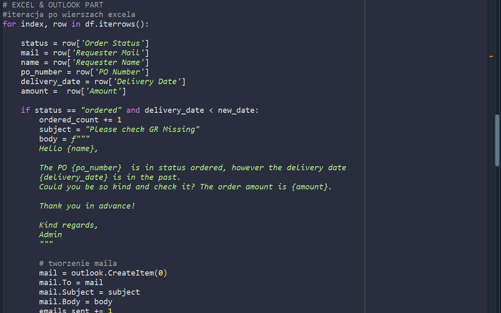
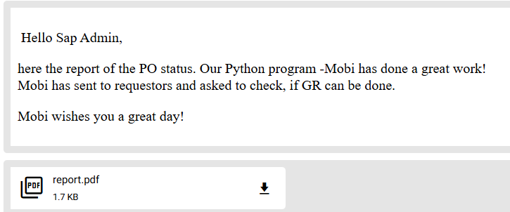

<div style="max-width: 760px;">

# Mobi---PTP 🚀
Program automatyzuje pracę w obszarze operacyjnym działu PTP

<hr style="border:1px solid #BFEFFF;">

### Autor: Kamila Dudzińska

### 📊 Projekt: Program 'Mobi' do automatyzacji maili 
Mobi jest dedykowany dla procesów operacyjnych dla działu zakupów (Indirect Procurement).

### 📂 Źródło: Procurement_mock_dataset1 
Mockowy zestaw danych, który odzwierciedla dokładną architekturę techniczną, inżynierię danych oraz logikę biznesową systemu SAP Ariba. Zestaw danych został wygenerowany przez skrypt mojego autorastwa - dostępny na moim Githubie pod nazwą " SAP-Ariba-Mock-Data-Generator-for-Procurement-Analytics". Zawiera 2500 rekordów. --> [SAP-Ariba-Mock-Data-Generator-for-Procurement-Analytics](https://github.com/kamila-dudzinska/SAP-Ariba-Mock-Data-Generator-for-Procurement-Analytics)

" SAP-Ariba-Mock-Data-Generator-for-Procurement-Analytics" - Generator Danych Mockowych SAP Ariba dla Analityki Zakupowej (Procurement) 📊🧪 --> Narzędzie w Pythonie zaprojektowane do generowania syntetycznych, produkcyjnej jakości zestawów danych zamówień zakupu (Purchase Orders). Odzwierciedla ono dokładną architekturę techniczną, inżynierię danych oraz logikę biznesową systemu SAP Ariba. Ten projekt rozwiązuje kluczowy problem ekspertów ds. zakupów (Procurement), którzy chcą przejść do obszaru analizy danych: brak możliwości pracy na realnych danych korporacyjnych ze względu na surowe zasady compliance, umowy NDA oraz regulacje RODO.

### 🎯Cel: 
Stworzenie programu do analizy tabeli excel z danymi o zamówieniach w systemie SAP ARIBA oraz automatycznego wysyłania maili do kupców z przypomnieniem o konieczności zaksięgowania przyjęcia (GR). Program generuje też raport dla administratora, do kogo maile zostały wysłane i jakie są statystyki zamówień. Dzięki temu można jednym kliknięciem zaoszczędzić sporo FTE, a administrator może szybko uzyskać realny "stan rzeczy".

### ⚙️ Technologie:
- Python 🐍  
- pandas, reportlab, win32com  
- Excel, Outlook

### 🧩 Jak działa program
1. Program iteruje wiersz po wierszu w tabeli za zamówieniami. 
2. Jeśli znajdzie zamówienie (PO) ze statusem "ordered" ("zamówione") to sprawdzi dodatkowo prognozowaną datę dostawy (delivery date).
3. Jeżeli data dostawy jest w przeszłości (dzisiaj odjąć 3 dni*) to potraktuje to jako informację do wykonania zadania --> wyśle maila z przypomnieniem o zrobieniu GR do kupca.
5. Program czyta dane z tabeli excel, jeżeli jeden kupiec będzie miał kilka różnych zamówień, to zostaną wysłane do niego szczegóły o wszystkich zamówieniach.
7. Po wykonaniu zadania program poinformuje administratora, gdzie udało mu się wysłać maila - w przypadku aktywnej konsoli IDE oraz dodatkowo wyśle raport ze statystykami w formacie pdf na maila administratora.

### 🖥️ Zalety projektu:
* odpowiada na realny problem w wielu procesach operacyjnych, gdzie wymagane jest sprawdzanie i repetetywne wysyłanie przypominajek/follow-upów
* zmniejsza problem z tworzeniem przyjęcia GR przez nietechnicznych kupców, którzy często nie pilnują swoich zamówień tłumacząc to jako - "W Aribie Guided Buing nie da się filtrować po statusach". 
* dzięki monitorowaniu stanu zamówień (PO) i przyjęć (GR) można zmniejszyć "invoice overdue" (niepłacenie faktur na czas) a co za tym idzie - zminimalizować ryzyko kłopotów z dostawcami, czy utraty wizerunku
* administrator programu otrzymuje statystyki, dzięki czemu łatwiej kontrolować proces GR
* program automatyzuje pracę w obrębie działu zakupów
* program napisany pod typowe środowisko korporacyjne z zalogowanym "Outlookiem"
* program dedykowany SAP ARIBA (z racji, że pracuję na tym programie jako key user) ale można go szybko dopasować do innych systemów - wystarczy przeanalizować raporty generowane np. przez SAP MM, czy inny dowolny program

Kod dostępny w pliky mobi,py

<hr style="border:1px solid #BFEFFF;">

### ⚙️ Instalacja i uruchomienie
#### 🔧 Wymagania
- Python 3.10+  
- Zainstalowany Outlook (dla wysyłki maili) oraz opcjonalnie Excel do odczytu csv
- Biblioteki: `pandas`, `reportlab`, `win32com`, `os`, `datetime`

#### 📦 Instalacja
W katalogu projektu uruchom:
```bash
pip install pandas reportlab pywin32
```

### Tabela z zamówieniami (na niebiesko te zamówienia, gdzie Mobi powienien wysłać przypominajkę):


### Fragment kodu: Czyszczenie danych


### Fragment kodu: main loop


### Email administratora:


<hr style="border:3px solid #AEC6CF;">
### 📧 Kontakt: 
[](mailto:kamila.dudzinska@onet.pl)

🌐 [LinkedIn](https://www.linkedin.com/flagship-web/in/kamila-dudzi%C5%84ska-856bb31b8/)


